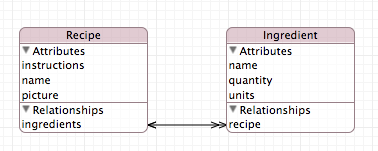
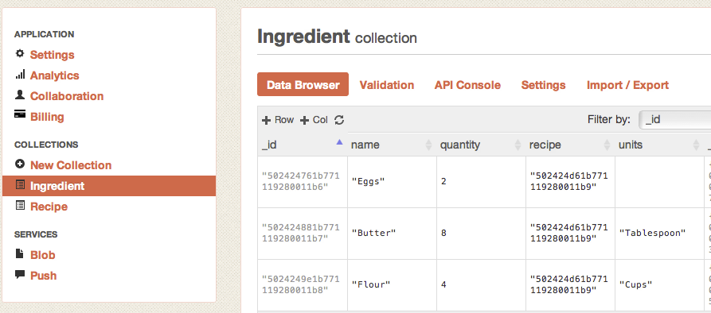

## KinveyKit Core Data Guide
Core Data provides a way for managing object life-cycle, object graphs, and persistence. KinveyKit provides similar persistence functionality without managing the objects' lifecycles.

With Core Data you have to define your data model up-front and persist it locally (iCloud provides offline syncing and backup tied to the users' account). Kinvey lets you define the relationships ad-hoc and store the data in the cloud. 

## Concepts

### Managed Objects
Core Data manages object lifecycle and tracks changes. This means that you don't have to worry about initializing objects, or being notified upon changes. KinveyKit has made the tradeoff of allowing you to persist any `NSObject` to the backend. This means to add a new object to the backend, you have to create an instance, set the appropriate data, and save it. Queries to the backend will return initialized objects of the appropriate type, but saves still have to be triggered by your code. 

### Querying
Core Data queries are performed using an `NSFetchRequest` with an `NSPredicate`. KinveyKit uses a `KCSQuery` object. KCSQueries are built using explicit methods like `addQueryOnField:usingConditional:forValue:` rather than a string using the predicate language of Core Data. The two languages aren't equivalent, but overlap conceptually. KCSQueries provide additional features for geographic location queries as well as logical and arithmetic queries on fields. 

### Relationships 
One of Core Data's main features is the object graph, which allows developers to express relationships between entities, usually as a one-to-one or one-to-many (and occasionally a many-to-many). With these relationships, you can load related objects from the parent object, and cascade deletes. Kinvey uses MongoDB on the backend, which only supports independent collections.  The way we get around this limitation is to store the unique `_id` of the relationship object(s) in the appropriate parent object field. When the object is fetched from the backend, we have to then perform a second `GET` from the related object's collection (and so on) to load the entire object graph. The inverse is true for saves and deletes.

TODO replace with KinveyRef discussion next iteration.

### Notifications
Using Core Data provides notifications when an object's data is changed or in the case of `NSFetchedResultsController` when any of its returned objects is changed. When you load objects from Kinvey's backend, the default behavior matches properties to collection field names through property names. This means collection data can be observed through Key-Value Observing (KVO), in a similar way that you would observe NSManagedObjects.

Core Data persistent stores are local to the device, and are thus unlikely to change without direct action of the user. Because you have the ability to make common entities on the backend, it is possible for data to change on the backend and making the fetched objects out-of-date. We do not have the ability at this time to automatically notify an app when such data changes. If you have data that is expected to change frequently, refresh it as-needed. 

## Migrating from Core Data to KinveyKit

### Entities and Collections
Kinvey's database does not use schemas so your object model becomes a convention rather than an enforceable contract. There's a lot of ways to architect your data, we recommend that you map Core Data Entities to individual collections in your backend, and an entity's attributes become the fields of the collection.

For example, let's say we're building a cookbook app. We have Recipe and Ingredient entities, where a Recipe is made up of multiple Ingredients:

To move to KinveyKit, we create a Recipe collection and an Ingredient Collection.

#### Validation
Core Data lets specify if a particular attribute is required, as well as information like a min, max, data type, etc. Kinvey collections allow for server-side validation, which can provide much the same data enforcement as attribute validation. This is beyond the scope of this document, but the instructions can be found [here](http://www.kinvey.com/blog/item/197-the-customizable-backend-as-a-service-step-one-input-validation).
 
### NSManagedObjects
NSManagedObjects are the workhorse of Core Data, and represent the object form of your entities. When migrating from Core Data you no longer need a NSManagedContext -- Kinvey's backend becomes the context.

To reuse a NSManagedObject subclass:

1. Turn NSManagedObject into a `NSObject <KCSPersistable>`
2. Turn any `@dynamic` properties into `@synthesize` ones. 
3. Add a `NSString` property for the objectId. NSManagedObjects have their own ids, but they are rarely used by the application code because the object context deals with relating them to the store. Since the objects now have to be managed by the application, KinveyKit needs a unique id to map the object to the backend. 
4. Implement [`hostToKinveyPropertyMapping`](http://docs.kinvey.com/ios-developers-guide.html#preparing_objects). Basically, the dictionary returned by this method becomes an entity-level schema. 

    For our Recipe object, it will look something like this. The name is the same as before, we've added the `objId` to map to the `_id` field on the the backend, and the list of related ingredients (see [below](#Handling_Relationships)). 
    
        - (NSDictionary *)hostToKinveyPropertyMapping
        {
            return @{@"objId" : KCSEntityKeyId, @"name" : @"name", @"ingredientIds" : @"ingredients"};
        }
    
### Saving
Core Data tracks changes so you can call `save:` on the NSManagedObjectContext to save all the modified objects. With KinveyKit, the client manages the objects, so they have to each manually be saved back to their owning collections. 

Continuing our example:

    KCSCollection* recipeCollection = [KCSCollection collectionFromString:@"Recipe" ofClass:[Recipe class]];
    KCSAppdataStore* store = [KCSAppdataStore storeWithCollection:recipeCollection options:nil];
    //note saveObject: can take an array of objects not just one at a time
    [store saveObject:recipe withCompletionBlock:^(NSArray *objectsOrNil, NSError *errorOrNil) {
        if (errorOrNil) {
            UIAlertView* alert = [[UIAlertView alloc] initWithTitle:[errorOrNil localizedDescription] message:[errorOrNil localizedFailureReason] delegate:self cancelButtonTitle:@"OK" otherButtonTitles:nil];
            [alert show];
        }
    } withProgressBlock:nil];
    
### Fetching
TODO

### Handling Relationships

#### Saves
Since the new objects span multiple collections, we want to save their relationships. Since the object graph cannot persisted at the same time, when serializing the object we want to store just the ids not the whole object. 

In this example, I've specified a substitution. When the `hostToKinveyPropertyMapping` is called by KinveyKit at save time, instead of saving the "ingredients" set, it'll call this method instead, which generats an array of ingredients object ids. This is what will be saved on the backend. When the Recipe entity is fetched from the server, we can just load the ingredients by id. 

    - (NSArray*) ingredientIds
    {
        NSMutableArray* ids = [NSMutableArray arrayWithCapacity:self.ingredients.count];
        for (Ingredient* i in self.ingredients) {
            [ids addObject:i.objId];
        }
        return ids;
     }

NOTE: If an id is manually assigned, it will be assigned by the backend when the object is saved. This means that the child elements should be saved first in order to make sure they have their id fields set before saving the parent object.

#### Loads
Because entities are stored in different collections, we will have to query associated objects separately from the parent object. 

In our example, when the `Recipe` object is loaded, we get back the array of `Ingredient` ids previously stored there. Most of the time the application will want those Ingredient objects and not just the ids, this example will fetch those silently in the background and update the `ingredients` set property. 

    - (void) setIngredientIds:(NSArray *)ingredientIds
    {
        KCSQuery* query = [KCSQuery queryOnField:@"ingredients" usingConditional:kKCSIn forValue:ingredientIds];
        KCSCollection* c = [KCSCollection collectionFromString:@"Ingredient" ofClass:[Ingredient class]];
        KCSCachedStore* store = [KCSCachedStore storeWithCollection:c options:@{KCSStoreKeyCachePolicy : @(KCSCachePolicyNetworkFirst)}];
        [store queryWithQuery:query withCompletionBlock:^(NSArray *objectsOrNil, NSError *errorOrNil) {
            if (errorOrNil != nil || objectsOrNil == nil) {
                self.ingredients = [NSMutableOrderedSet orderedSet];
            } else {
                self.ingredients = [NSMutableOrderedSet orderedSetWithArray:objectsOrNil];
                // the ordering will be in the array order, which is the same as we saved it in. This would be a good place to sort them, if necessary.
            }
        } withProgressBlock:nil];
    }
    
#### Deletes
Just like load and save, delete operations need to be applied to each collection, individually. For a nil-ing delete the relationship field can just be set to an empty array, but to cascade a delete, we can do something similar to save.

This method will delete the related ingredients first and then delete the recipe object.

    - (void) deleteRecipe:(Recipe*) r
    {
        KCSCollection* ingredientCollection = [KCSCollection collectionFromString:@"Ingredient" ofClass:[Ingredient class]];
        KCSAppdataStore* ingredientStore = [KCSAppdataStore storeWithCollection:ingredientCollection options:nil];
        //[self.ingredients array] should be used here instead of the array of ids, since the store expects to work with objects. It will look up the ids itself.
        [ingredientStore removeObject:[r.ingredients array] withCompletionBlock:^(NSArray *objectsOrNil, NSError *errorOrNil) {
            if (!errorOrNil) {
                //if no error, okay to delete this object
                //note the store should really be a reusable object, but a local one is created here for the sake of short example
                KCSCollection* recipeCollection = [KCSCollection collectionFromString:@"Recipe" ofClass:[Recipe class]];
                KCSAppdataStore* recipeStore = [KCSAppdataStore storeWithCollection:recipeCollection options:nil];
                [recipeStore removeObject:r withCompletionBlock:^(NSArray *objectsOrNil, NSError *errorOrNil) {
                    if (!errorOrNil) {
                        //object is deleted; to mirror Core Data functionality more closely, the r object should be marked as deleted, maybe via a property: e.g. r.deletedFromKinvey = YES;
                    } else {
                        //handle error
                    }
                } withProgressBlock:nil];
            } else {
                //handle error
            }
        } withProgressBlock:nil];
    } 

### Migrating Saved Data
TODO
